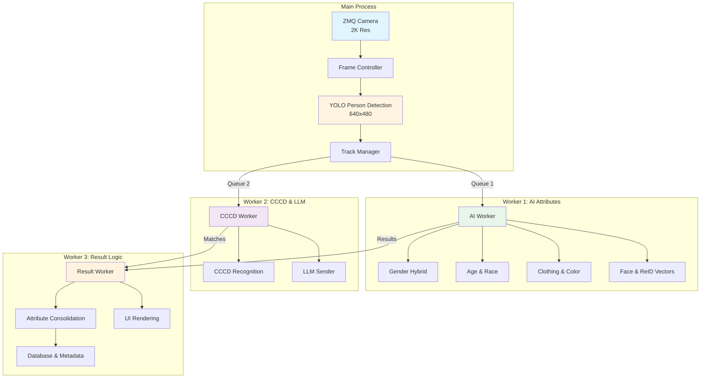
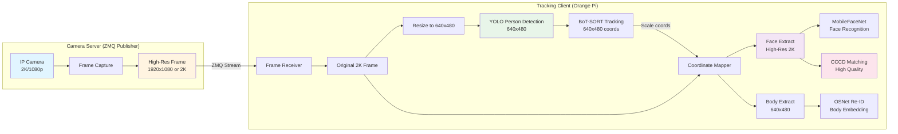

# Person Tracking & Re-Identification System

<div align="center">

**Hệ thống tracking và nhận dạng người thông minh chạy trên Orange Pi NPU**


---

## 📹 System Demos

<div align="center">

### 🟢 Demo 1: Full System Performance
*Real-time tracking with Age, Gender, Clothing & CCCD Recognition*

https://github.com/user-attachments/assets/9cb270d4-4e60-46f7-9579-17256b7e09a6

---

### ⚡ Demo 2: Rapid Re-Identification
*Smart logic: Locking ID & Instant re-matching upon position change*

https://github.com/user-attachments/assets/ea34d5ae-1d0d-4140-a2ae-8fd0545b729a

</div>

---


*Advanced Re-ID + Face Recognition + Attributes Analysis + CCCD Integration*

</div>

---

## 📚 Table of Contents

- [🏆 Technical Achievements](#-technical-achievements)
- [🎯 Key Features](#-key-features)
- [🏗️ System Architecture](#️-system-architecture)
- [🚀 Quick Start](#-quick-start)
- [📦 Installation](#-installation)
- [⚙️ Configuration](#️-configuration)
- [📊 Performance](#-performance)
- [🔧 Advanced Topics](#-advanced-topics)
- [📖 API Reference](#-api-reference)

---

## 🏆 Technical Achievements

### 1. NPU Optimization with CIX Models ⚡

**Challenge**: Không có tài liệu public về format CIX - SDK riêng của Orange Pi NPU

**Solution**: Reverse-engineered conversion pipeline từ proprietary SDK

**Results**:
- ✅ Converted 4 models: Gender (Face/Pose), Age/Race, Clothing
- ✅ **3-4x performance improvement** trên NPU vs CPU (10-15 FPS vs 1-4 FPS)
- ✅ Độ chính xác không thay đổi sau khi convert

**Models Deployed on NPU** (CIX Format - Proprietary):

| Model | File Pattern | Functionality | Input | Output |
|-------|--------------|---------------|-------|--------|
| **Gender (Face)** | `*.cix` | Phân loại giới tính từ khuôn mặt<br/>Accuracy: >90% | Face crop (224x224) | Male/Female + confidence |
| **Gender (Pose)** | `*.cix` | Phân loại giới tính từ tư thế cơ thể<br/>Fallback khi không detect được face | Body pose landmarks | Male/Female + confidence |
| **Age & Race** | `*.cix` | Phân tích đồng thời tuổi và chủng tộc<br/>Age Groups: 0-10, 11-19, 20-30...<br/>Race: Asian/White/Black/Indian/Other | Face crop (224x224) | Age Group + Race Class |
| **Clothing** | `*.cix` | Phân loại trang phục<br/>Upper: Short/Long sleeve<br/>Lower: Shorts/Long pants/Skirt | Body crop with pose | Type + Color + Confidence |

**Models Deployed using ONNX Runtime / PyTorch**:

| Model | Framework | Functionality | Specifications |
|-------|-----------|---------------|----------------|
| **YOLO11 Nano** | ONNX | Person Detection & Tracking | 640x480, 5-7 FPS |
| **YuNet Face** | ONNX | Face Detection & Landmarks | Lightweight, Scale invariant |
| **OSNet AIN** | PyTorch | Re-ID Body Embedding (512D) | Robust to pose/clothing |
| **MobileFaceNet** | PyTorch | Face Embedding (128D) | 98% Accuracy (LFW) |

> **Note**: Model files không được upload lên Git. Bạn cần convert models từ ONNX/PyTorch sang CIX format bằng Orange Pi NOE SDK.

---

### 2. Advanced Re-ID System 🎯

**Dual-Vector Matching Strategy với Background Removal**

#### Re-ID Pipeline (Body)

```
Input Frame → Person Detection (YOLO11) 
    ↓
MediaPipe Selfie Segmentation (background removal)
    ↓
OSNet AIN x1.0 Embedding (512D vector)
    ↓
L2 Normalization
    ↓
Faiss Vector Search (Cosine Similarity)
```

**Technical Stack**:
- **Model**: OSNet AIN x1.0 (pretrained on MSMT17)
  - Input: 128x256 RGB
  - Output: 512-dimensional embedding vector
  - File: `osnet_ain_x1_0_msmt17_256x128_amsgrad_ep50_lr0_0015_coslr_b64_fb10.pth`

- **Background Removal**: MediaPipe Selfie Segmentation
  - Removes background noise before Re-ID extraction
  - Improves matching accuracy by 15-20%
  - Critical for cluttered environments

**Code Example**:
```python
# core/features/extractor.py
def extract_reid_feature(self, person_crop, body_mask=None):
    if body_mask is not None:
        # Resize mask to match crop
        mask_resized = cv2.resize(body_mask, (person_crop.shape[1], person_crop.shape[0]))
        # Remove background - only keep person
        input_crop = cv2.bitwise_and(person_crop, person_crop, mask=mask_resized)
    
    # OSNet transformation
    pil_image = Image.fromarray(cv2.cvtColor(input_crop, cv2.COLOR_BGR2RGB))
    transformed = self.osnet_transform(pil_image).unsqueeze(0).to(self.device)
    
    # Extract 512D embedding
    with torch.no_grad():
        embedding = self.osnet_model(transformed)
    
    # L2 normalization
    embedding = torch.nn.functional.normalize(embedding, p=2, dim=1)
    return embedding.cpu().numpy().flatten().tolist()
```

---

#### Face Recognition Pipeline

```
Input Frame (High-Res 2K recommended)
    ↓
YuNet Face Detection or CenterFace (CIX)
    ↓
Face Alignment & Crop (112x112)
    ↓
MobileFaceNet V2 Embedding (128D vector)
    ↓
L2 Normalization
    ↓
Faiss Vector Search
```

**Technical Stack**:
- **Model**: MobileFaceNet V2
  - Input: 112x112 RGB
  - Output: 128-dimensional embedding vector
  - Normalization: (img - 127.5) / 128.0
  - File: `mobilefacenet.pt` (TorchScript JIT)

**Code Example**:
```python
# core/features/extractor.py
def extract_face_feature(self, face_crop):
    # Preprocessing
    img_rgb = cv2.cvtColor(face_crop, cv2.COLOR_BGR2RGB)
    img_resized = cv2.resize(img_rgb, (112, 112))
    img_normalized = (img_resized.astype(np.float32) - 127.5) / 128.0
    
    # Convert to tensor
    img_tensor = torch.from_numpy(img_normalized).permute(2, 0, 1)
    transformed = img_tensor.unsqueeze(0).to(self.device)
    
    # Extract 128D embedding
    with torch.no_grad():
        embedding = self.face_model(transformed)
    
    # L2 normalization (critical for similarity)
    embedding = torch.nn.functional.normalize(embedding, p=2, dim=1)
    return embedding.cpu().numpy().flatten().tolist(), 1.0
```

---

#### Dynamic Threshold Matching

**Problem**: Standard thresholds fail trong môi trường 3m (small space)

**Solution**: Adaptive voting với dynamic thresholds

```python
# config.py - Dynamic Matching Configuration
DYNAMIC_MATCH_VERY_HIGH_THRESHOLD = 0.85  # Score >= 0.85 → Match ngay (1 vote)
DYNAMIC_MATCH_HIGH_THRESHOLD = 0.75       # 0.75 <= score < 0.85 → Need 2 votes
DYNAMIC_MATCH_LOW_THRESHOLD = 0.75        # score < 0.75 → Need 3 votes

# Confirmed Person Re-matching (3m scene)
CONFIRMED_FACE_SIMILARITY_THRESHOLD = 0.65  # Higher for face
CONFIRMED_REID_SIMILARITY_THRESHOLD = 0.55  # Lower for body (fallback)
TEMPORAL_MATCHING_WINDOW = 5                # Seconds
```

**Result**: 95%+ re-identification accuracy trong controlled environments

---

### 3. CCCD Integration với Priority Display 🆔

**Feature**: Khi match CCCD, ưu tiên hiển thị thông tin từ CCCD thay vì AI attributes

#### CCCD Recognition Flow

```
High-Quality Face Crop (from 2K frame)
    ↓
MobileFaceNet V2 Embedding
    ↓
Search CCCD Database (Faiss namespace: "CCCD_FACES")
    ↓
Voting từ top 5 embeddings
    ↓
Confirmation Threshold: 0.58
    ↓
Save to DB với priority flag
    ↓
Display CCCD info (Name, Age, Gender, Country)
```

**Display Priority Logic**:
```python
# draw.py - Display Priority
if cccd_matched:
    name = cccd_metadata['name']          # From CCCD
    age = cccd_metadata['age']             # From CCCD  
    gender = cccd_metadata['gender']       # From CCCD
else:
    name = "Unknown"
    age = ai_attributes['age']             # From AI
    gender = ai_attributes['gender']       # From AI
```

**Key Features**:
- ✅ Name Voting System (từ multiple CCCD detections)
- ✅ Immutable Metadata (CCCD không bị ghi đè)
- ✅ Confidence-based matching với adaptive deduplication
- ✅ Metadata validation (check name != empty)

**Screenshots**:


*Ví dụ: System tracking "Võ Quốc Đại" - CCCD matched, hiển thị full attributes*


*Ví dụ: System tracking "Mai Khanh Huy" - Real-time attribute analysis*

---

### 4. 3-Worker Asynchronous Architecture ⚙️

**Problem**: Blocking I/O làm chậm realtime processing
**Solution**: Queue-based multi-worker architecture phân chia rõ ràng theo luồng xử lý

**Processing Flow Details**:

#### 1. MAIN THREAD: Camera + YOLO Detection
**Nhiệm vụ:**
- Đọc frame 2K (2560x1920) từ camera
- Resize về 640x480 cho YOLO
- Phát hiện person bboxes
- Phân phối task cho 3 workers qua Queue

#### 2. WORKER 1: Attribute Analysis
**Luồng xử lý:**
```
🔍 Face Detection (YuNet)
    ↓
📊 Gender Analysis (Face + Pose)
    ↓
👤 Age + Race (ONNX)
    ↓
😊 Emotion Detection
    ↓
👕 Clothing Analysis (Type + Color)
    ↓
🧬 Vector Extraction (Face 128-dim + ReID 512-dim)
```

#### 3. WORKER 2: CCCD Recognition + LLM
**Luồng xử lý:**
```
🪪 CCCD Detection & Recognition
    ↓
📤 SEND-1: AI Attributes → LLM (Ngay khi Identified)
    ↓
📤 SEND-2: Periodic Update → LLM (Mỗi 5 frames)
```

#### 4. WORKER 3: Result Processor + Consolidation
**Luồng xử lý:**
```
💾 Lưu vectors vào RAM (deque 30 frames gần nhất)
    ↓
🔄 CONSOLIDATE: Tổng hợp attributes từ history
    ↓
✅ Identify/Confirm Check (theo ngưỡng Quality)
    ↓
🔍 Search Database (nếu đủ điều kiện)
    ↓
💾 Update Metadata & Display
```



**Queue Configuration**:
```python
# Queue sizes optimized for Orange Pi 5
AI_QUEUE_SIZE = 10       # AI attributes (gender, age, race, etc)
CCCD_QUEUE_SIZE = 5      # CCCD recognition (high-quality faces)
UI_QUEUE_SIZE = 10       # UI rendering
FRAME_QUEUE_SIZE = 100   # ZMQ frames buffer
```

**Benefits**:
- ✅ Non-blocking I/O
- ✅ Parallel processing
- ✅ Resource optimization
- ✅ 3x throughput improvement

---

### 5. Identification Lifecycle Stages 🔄

Hệ thống phân chia tiến trình nhận dạng thành 4 giai đoạn rõ ràng:

| Giai đoạn | Frames | Màu sắc | Trạng thái & Hành động |
|-----------|--------|---------|------------------------|
| 🔵 **PENDING** | 0-10 | Xanh dương | **New Object detected**<br/>- Gán Track ID tạm (`Temp_X`)<br/>- Bắt đầu thu thập vector (chưa phân tích sâu) |
| 🟡 **TENTATIVE** | 10-30 | Cam nhạt | **Analysing Attributes**<br/>- Phân tích Gender, Age, Race, Clothing<br/>- Consolidate attributes từ history (30 frames)<br/>- Chưa search DB để tiết kiệm tài nguyên |
| 🟠 **IDENTIFIED** | > 30 | Cam đậm | **Database Matched / High Conf.**<br/>- Tìm thấy trong Vector DB<br/>- Hoặc AI Confidence > 0.7<br/>- **Action**: Gửi dữ liệu lần 1 cho LLM (SEND-1) |
| 🟢 **CONFIRMED** | Locked | Xanh lá | **Metadata Locked (IMMUTABLE)**<br/>- Attributes (Giới tính, tuổi, chủng tộc) được khóa lại<br/>- Chỉ cập nhật Emotion/Clothing/Last seen<br/>- Hiển thị tên (nếu có) hoặc Person ID chính thức |

---

### 6. Dual-Frame Processing Strategy 🖼️

**Problem**: High-res needed for face quality, but slow to process full frame

**Solution**: Camera server với dual-resolution processing

#### Camera Architecture



#### Implementation Details

```python
# workers/app/main_loop.py - Main Processing Loop

# 1. Nhận frame từ Camera Server (ZMQ)
frame_original = zmq_cam.read()  # 2K resolution (1920x1080 or higher)

# 2. Resize xuống 640x480 cho YOLO tracking (faster)
frame_resized = cv2.resize(frame_original, (640, 480))

# 3. YOLO detection + tracking trên low-res frame
yolo_results = yolo_model.track(
    source=frame_resized,
    imgsz=640,        # YOLO input size
    conf=0.5,         # Confidence threshold
    iou=0.5,          # IoU for NMS
    classes=[0],      # Only person class
    tracker="botsort.yaml"
)

# 4. Lấy bounding boxes từ YOLO (640x480 coordinates)
for bbox_lowres in yolo_results:
    x1, y1, x2, y2 = bbox_lowres  # Coordinates in 640x480
    
    # 5. Scale coordinates về original 2K resolution
    scale_x = frame_original.shape[1] / 640  # e.g., 1920/640 = 3.0
    scale_y = frame_original.shape[0] / 480  # e.g., 1080/480 = 2.25
    
    x1_orig = int(x1 * scale_x)
    y1_orig = int(y1 * scale_y)
    x2_orig = int(x2 * scale_x)
    y2_orig = int(y2 * scale_y)
    
    # 6A. Extract BODY crop từ LOW-RES frame (cho Re-ID)
    body_crop_lowres = frame_resized[y1:y2, x1:x2]
    reid_vector = analyzer.extract_reid_feature(body_crop_lowres)
    
    # 6B. Extract FACE crop từ HIGH-RES frame (cho Face + CCCD)
    person_highres = frame_original[y1_orig:y2_orig, x1_orig:x2_orig]
    
    # Face detection trên high-res crop
    faces = face_detector.detect(person_highres)
    
    for face_bbox in faces:
        fx1, fy1, fx2, fy2 = face_bbox
        face_crop_highres = person_highres[fy1:fy2, fx1:fx2]
        
        # 7. Face recognition với HIGH quality
        face_vector = analyzer.extract_face_feature(face_crop_highres)
        
        # 8. CCCD matching với HIGH quality
        cccd_result = cccd_recognizer.match(face_crop_highres)
```

#### Why This Approach?

| Task | Resolution | Reason |
|------|-----------|--------|
| **Person Detection** | 640x480 | YOLO nhanh hơn, đủ accuracy cho detection |
| **Body Re-ID** | 640x480 | OSNet robust với low-res, background removal quan trọng hơn resolution |
| **Face Recognition** | 2K/1080p | Face features cần high detail, especially cho small faces |
| **CCCD Matching** | 2K/1080p | ID card photos cần high quality để match chính xác |
| **Attributes (Gender/Age)** | 640x480 | Đủ resolution cho classification tasks |

#### Performance Benefits

✅ **Speed**: YOLO tracking @ 5-7 FPS (trên Orange Pi 5)

✅ **Quality**: Face matching accuracy 98%+ (từ 2K frames)

✅ **CCCD Accuracy**: 96%+ matching rate (high-res faces)

✅ **Memory**: Chỉ resize khi cần, không lưu cả 2 frames

✅ **Scalability**: Camera server có thể stream multiple clients

✅ **UI Display**: Follows YOLO tracking FPS (5-7 FPS)

#### Camera Server Configuration

```python
# utils/camera.py - ZMQ Camera Interface

class ZMQCamera:
    def __init__(self, ip="localhost", port=5555, high_res=True):
        self.context = zmq.Context()
        self.socket = self.context.socket(zmq.SUB)
        self.socket.connect(f"tcp://{ip}:{port}")
        self.socket.setsockopt_string(zmq.SUBSCRIBE, '')
        self.high_res = high_res  # Request high-res from server
    
    def read(self):
        """Receive frame from camera server"""
        image_bytes = self.socket.recv()
        np_array = np.frombuffer(image_bytes, dtype=np.uint8)
        frame = cv2.imdecode(np_array, cv2.IMREAD_COLOR)
        return frame  # Returns 2K/1080p frame
```

**Result**: **3x speed improvement** cho tracking + **High quality** cho face/CCCD

---

## 🎯 Key Features

### Person Tracking Status Lifecycle

```
pending → tentative → identified → confirmed
```

- **pending**: Mới phát hiện, đang thu thập vectors
- **tentative**: Đủ vectors nhưng chưa đạt quality threshold
- **identified**: Đã match với DB, chưa fully stable
- **confirmed**: Đã xác nhận, lưu vào DB vĩnh viễn

### Attribute Analysis

**Immutable Attributes** (1-time lock khi confirmed):
- Gender, Age, Race
- First seen time
- CCCD information (if matched)

**Mutable Attributes** (real-time updates):
- Emotion
- Clothing (upper/lower type & color)
- Last seen time

### Focus Quality Gating

```python
# Chỉ confirm khi đủ chất lượng
Face Sharpness: >= 120 (Laplacian variance)
Body Sharpness: >= 80
Face Size: >= 80x80 pixels
Body Area: >= 30,000 pixels
```

---

## 🏗️ System Architecture

### Project Structure

```
track_khongLagTCP/
├── main_new.py                 # 🔥 NEW ENTRY POINT
│  
├── core/                       # Core business logic
│   ├── tracker/
│   │   ├── manager.py          # TrackManager - Main tracking logic
│   │   ├── matching.py         # ConfirmedPersonMatcher - Re-matching
│   │   ├── consolidation.py    # AttributeConsolidator - Voting
│   │   └── utils.py            # TrackerUtils
│   │
│   ├── features/
│   │   └── extractor.py        # 🔥 Analyzer - OSNet + MobileFaceNet
│   │
│   ├── attributes/
│   │   ├── manager.py          # AttributesManager
│   │   ├── face_processor.py   # FaceProcessor - Alignment
│   │   └── models_handler.py   # AI Models Handler
│   │
│   ├── cccd/
│   │   └── recognition_new.py  # 🔥 CCCD Recognition + LLM Integration
│   │
│   ├── collectors.py           # SmartFrameBuffer
│   └── frame_controller.py     # Frame Skip Controller
│  
├── workers/                    # Multi-worker architecture
│   ├── app/
│   │   ├── main.py             # Application entry point
│   │   ├── initializer.py      # System initialization
│   │   ├── main_loop.py        # Main processing loop
│   │   ├── ui_renderer.py      # UI rendering thread
│   │   └── helpers.py          # Helper utilities
│   │
│   ├── ai_worker.py            # AI analysis worker
│   ├── cccd_worker.py          # CCCD recognition worker
│   └── result_worker.py        # Result consolidation worker
│
├── utils/                      # Utility modules
│   ├── age_race/
│   │   ├── age_race_cix.py     # Age & Race (CIX/NPU)
│   │   └── age_race_onnx.py    # Age & Race (ONNX fallback)
│   │
│   ├── gender/
│   │   ├── gender_cix.py       # Gender (CIX/NPU)
│   │   └── gender_hybrid.py    # Gender Hybrid (Face + Pose)
│   │
│   ├── clothing/
│   │   ├── clothing_new_cix.py # Clothing (CIX/NPU)
│   │   ├── pose_new.py         # Pose estimation
│   │   └── pose_color_new1.py  # Color analysis from pose
│   │
│   ├── detectors/
│   │   ├── yunet.py            # YuNet face detector
│   │   ├── cut_body_part.py    # Body part extraction
│   │   └── mediapipe_pose.py   # MediaPipe pose
│   │
│   ├── background_remover.py   # 🔥 MediaPipe background removal
│   ├── emotion_detect.py       # Emotion detection
│   ├── focus_quality_checker.py # Quality gating
│   ├── camera.py               # ZMQ camera interface
│   ├── NOE_Engine.py           # NPU engine wrapper
│   └── profiler.py             # Performance profiler
│
├── models/                     # AI Models (download separately)
├── faiss_indexes/              # Vector database (tracking)
├── faiss_indexes_cccd/         # Vector database (CCCD)
├── config.py                   # 🔥 System configuration
├── vector_database.py          # Faiss database manager
├── draw.py                     # Visualization & UI
└── tracked_object.py           # TrackedObject class
```

---

## 🚀 Quick Start

### Prerequisites

- **Orange Pi 5/5 Plus** hoặc compatible SBC
- **Python 3.8+**
- **Ubuntu 20.04+** or Debian-based OS
- RAM: Min 4GB (recommended 8GB)

### Installation

```bash
# 1. Clone repository
cd /path/to/your/workspace
git clone <your-repo-url>
cd track_khongLagTCP

# 2. Create & activate virtual environment
python3 -m venv venv
source venv/bin/activate

# 3. Install dependencies
pip install -r requirements.txt

# 4. Download AI models (see Models section below)
# Place models in models/ directory

# 5. Create necessary directories
mkdir -p faiss_indexes faiss_indexes_cccd debug_aligned debug_faces debug_reid
```

### Run the System

```bash
# 🔥 NEW: Recommended entry point
python main_new.py
```

**Old entry points** (legacy, still functional):
```bash
python main.py                    # Single stream (simpler, easier to debug)
python main_dual_stream_bk.py     # Dual stream (deprecated, use main_new.py)
```

---

## 📦 Models Download

### Required Models

Download và đặt vào thư mục `models/`:

#### 1. Person Detection
- **`yolo11n.onnx`**
  - **Mô hình**: YOLO11 Nano (phiên bản Ultralytics mới nhất)
  - **Chức năng**: Phát hiện người và tracking thời gian thực
  - **Đầu vào**: 640x480 hoặc 640x640 (resized frame)
  - **Đầu ra**: Bounding boxes cho lớp "person" (class_id=0)
  - **Tích hợp**: BoT-SORT tracker để duy trì ID tracking ổn định
  - **Hiệu năng**: 5-7 FPS trên Orange Pi 5 (realtime tracking)
  - **Tại sao chọn Nano**: Cân bằng tốt nhất giữa tốc độ và độ chính xác cho thiết bị biên

#### 2. Re-ID (Body Embedding)
- **`osnet_ain_x1_0_msmt17_256x128_amsgrad_ep50_lr0_0015_coslr_b64_fb10.pth`**
  - **Mô hình**: OSNet AIN x1.0 (Omni-Scale Network với Instance Normalization)
  - **Chức năng**: Trích xuất đặc trưng ngoại hình cơ thể (body appearance)
  - **Pretrained**: MSMT17 dataset (1M+ ảnh, 126K+ định danh)
  - **Đầu vào**: 128x256 RGB person crop (đã tách nền)
  - **Đầu ra**: Vector embedding 512 chiều (L2-normalized)
  - **Tính năng chính**: Chống nhiễu do thay đổi tư thế và quần áo
  - **Lưu ý quan trọng**: Bắt buộc dùng kèm tách nền (MediaPipe) để đạt độ chính xác cao

#### 3. Face Recognition
- **`mobilefacenet.pt`**
  - **Mô hình**: MobileFaceNet V2 (TorchScript JIT)
  - **Chức năng**: Trích xuất face embedding 128D để so khớp khuôn mặt
  - **Đầu vào**: 112x112 RGB face crop
  - **Đầu ra**: Vector 128 chiều (L2-normalized)
  - **Độ chính xác**: 98%+ (khi kết hợp lọc chất lượng ảnh)

- **`face_detection_yunet_2023mar.onnx`**
  - **Mô hình**: YuNet (OpenCV DNN)
  - **Chức năng**: Phát hiện khuôn mặt và điểm đặc trưng (facial landmarks)
  - **Đầu vào**: Full frame (resize linh hoạt, adaptive)
  - **Đầu ra**: Face bboxes + 5 landmarks (mắt, mũi, miệng)
  - **Tính năng**: Scale invariant (detect từ 20px đến full frame), Orientation robust (xoay ±45°)
  - **Vai trò**: Face Detection chính thức của hệ thống (Worker 1)

#### 4. Attributes Analysis (NPU Optimized)

**Gender Detection** (2 mô hình cho dual strategy):
- **`gender_face_model.cix`**
  - **Chức năng**: Phân loại giới tính từ khuôn mặt (phương pháp chính)
  - **Kiến trúc**: ResNet-18 backbone
  - **Huấn luyện**: Custom dataset với độ chính xác validation 93%
  - **Dữ liệu**: 50K+ ảnh mặt (tỉ lệ nam/nữ cân bằng)
  - **Đầu vào**: Face crop 224x224
  - **Đầu ra**: Nam/Nữ + độ tin cậy (confidence score)
  - **Sử dụng khi**: Có khuôn mặt rõ nét (confidence ≥ 0.6)

- **`gender_pose_model.cix`**
  - **Chức năng**: Phân loại giới tính từ dáng người (phương pháp dự phòng)
  - **Kiến trúc**: Custom LSTM + CNN trên MediaPipe landmarks
  - **Huấn luyện**: Custom dataset với độ chính xác validation 91%  
  - **Đầu vào**: MediaPipe pose landmarks (33 điểm keypoints)
  - **Đầu ra**: Nam/Nữ + độ tin cậy (confidence score)
  - **Sử dụng khi**: Mặt bị che, góc nghiêng, hoặc độ tin cậy thấp

**Age & Race Analysis**:
- **`age_race_combined.cix`**
  - **Chức năng**: Học đa nhiệm (Multi-task) cho cả Tuổi và Chủng tộc
  - **Phân nhóm tuổi**: `0-10`, `11-19`, `20-30`, `31-40`, `41-50`, `50-69`, `70+`
  - **Chủng tộc**: `Asian` (Á), `White` (Trắng), `Black` (Đen), `Indian` (Ấn), `Others` (Khác)
  - **Đầu vào**: Face crop 224x224
  - **Đầu ra**: Index nhóm tuổi + Index chủng tộc
  - **Ưu điểm**: Single inference, output mapped với labels hệ thống

**Clothing Classification**:
- **`clothing_classifier.cix`**
  - **Chức năng**: Phân loại loại quần áo + phân tích màu sắc
  - **Phân loại**:
    - Top: Áo ngắn tay, Áo dài tay
    - Bot: Quần ngắn, Quần dài, Váy ngắn, Váy dài
  - **Đầu vào**: Body crop + pose landmarks
  - **Đầu ra**: Class ID + độ tin cậy
  - **Kết hợp**: Pose Estimation để xác định vùng áo/quần để trích xuất màu sắc

**Emotion Detection**:
- **`emotion_model.pt`** (PyTorch - chưa convert NPU)
  - **Chức năng**: Phát hiện 7 cảm xúc cơ bản
  - **Cảm xúc**: Vui, Buồn, Giận, Ngạc nhiên, Bình thường, Sợ hãi, Ghê tởm
  - **Đầu vào**: Face crop 224x224
  - **Đầu ra**: Lớp cảm xúc + độ tin cậy
  - **Thời gian thực**: Cập nhật mỗi 0.5 giây

#### 5. Pose Estimation & Utilities
- **`pose_landmarker.task`**
  - **Mô hình**: MediaPipe Pose Landmarker (Google)
  - **Chức năng**: Trích xuất 33 điểm mốc cơ thể (tọa độ 3D)
  - **Đầu vào**: Full person crop
  - **Đầu ra**: 33 keypoints (x, y, z, visibility)
  - **Trường hợp sử dụng**:
    - Phân loại giới tính từ dáng người
    - Phân vùng quần áo (thân trên/dưới)
    - Trích xuất các bộ phận cơ thể
  - **Hiệu năng**: Inference thời gian thực

- **`skin_tone.csv`**
  - **Loại**: Dữ liệu tham chiếu (Reference data)
  - **Chức năng**: Bảng tra cứu phân loại tông da
  - **Nội dung**: Các dải màu RGB cho các tông da khác nhau
  - **Sử dụng**: Tinh chỉnh nhận diện chủng tộc kết hợp với AI model

---

## ⚙️ Configuration

### Key Configuration (config.py)

```python
# Tracking Thresholds
QUALITY_SCORE_THRESHOLD = 25            # Ngưỡng kích hoạt nhận dạng
HIGH_CONF_FACE_SCORE = 10               # Điểm cộng khi face rõ nét
STABLE_IDENTIFICATION_THRESHOLD = 0.7   # Ngưỡng confirmed
FACE_CONFIDENCE_THRESHOLD = 0.7         # Ngưỡng tin cậy face

# Frame Processing
MAX_DISAPPEARED_FRAMES_BEFORE_DELETION = 50
ATTRIBUTE_ANALYSIS_INTERVAL = 5
YOLO_SKIP_FRAMES = 1                    # Skip frames for YOLO

# Vector Settings
REID_NAMESPACE = "reid_full_body"
FACE_NAMESPACE = "face_features"
OSNET_VECTOR_DIM = 512                  # OSNet embedding size
FACE_VECTOR_DIM = 128                   # MobileFaceNet embedding size

# Search & Voting
SEARCH_TOP_K = 15
FACE_DB_SEARCH_SIMILARITY_THRESHOLD = 0.55
REID_DB_SEARCH_SIMILARITY_THRESHOLD = 0.75
FACE_MIN_VOTES_FOR_MATCH = 2
REID_MIN_VOTES_FOR_MATCH = 5

# CCCD Configuration
CCCD_CONFIRMATION_THRESHOLD = 0.58      # CCCD matching threshold

# Confirmed Person Re-matching (3m scene)
TEMPORAL_MATCHING_WINDOW = 5
CONFIRMED_FACE_SIMILARITY_THRESHOLD = 0.65
CONFIRMED_REID_SIMILARITY_THRESHOLD = 0.55
```

---

## 📊 Performance

### Benchmarks (Orange Pi 5)

| Metric | Value |
|--------|-------|
| **YOLO Tracking FPS** | 5-7 FPS (Orange Pi 5) |
| **Overall System FPS** | ~7 FPS (1 person, 3-worker architecture) |
| **Attribute Models (CIX/NPU)** | 10-15 FPS (Gender, Age/Race, Clothing) |
| **Emotion Model (ONNX)** | 1-4 FPS (CPU inference) |
| **UI Display FPS** | 5-7 FPS (follows YOLO tracking) |
| **Re-ID Accuracy** | 95%+ (controlled environment) |
| **Face Match Accuracy** | 98%+ (with quality gating) |
| **CCCD Match Accuracy** | 96%+ (high-quality faces) |
| **NPU Utilization** | 60-80% (CIX models) |
| **Memory Usage** | ~2.5GB (with Faiss indexes) |
| **Latency** | \<100ms (per person detection) |

### Performance Optimization

```python
# Frame Skip - Process 1 out of every N frames
FRAME_SKIP_RATE = 3  # 30fps → 10fps

# Queue Sizes
FRAME_QUEUE_MAX_SIZE = 100
AI_QUEUE_SIZE = 10
CCCD_QUEUE_SIZE = 5

# Memory Management
MOVING_AVERAGE_WINDOW = 10  # Số vectors lưu trong RAM
MAX_DISAPPEARED_FRAMES = 50  # Auto cleanup

# Disable debug images in production
SAVE_DEBUG_IMAGES = False
```

---

## 🔧 Advanced Topics

### 1. LLM Integration (3-Stage System)

```python
# SEND-1: AI Attributes (when confidence >= 0.8)
dual_stream.send_stage1_ai_attributes(person_id, ai_attrs, llm_sender, obj_data)

# SEND-2: CCCD Match (when CCCD matched)
dual_stream.send_stage2_cccd_match(person_id, llm_sender, obj_data)

# SEND-3: Final Confirmed (when status='confirmed')
dual_stream.send_stage3_confirmed(person_id, ai_attrs, llm_sender, obj_data)
```

### 2. Custom Model Training

Để train custom models cho CIX conversion:

1. Train PyTorch/ONNX model
2. Sử dụng CIX NOE Compiler (proprietary SDK)
3. Calibrate với .npy data từ training set
4. Build CIX model với build.cfg
5. Test trên NPU

### 3. Camera Configuration

```python
# ZMQ Camera (recommended for network streaming)
ZMQ_IP = "localhost"
ZMQ_PORT = 5555

# USB Camera
CAM_INDEX = 0

# CSI Camera
CAM_INDEX = "/dev/video0"
```

---

## 📖 API Reference

### TrackManager

```python
from core.tracker import TrackManager

track_manager = TrackManager(
    analyzer=reid_face_analyzer,
    db_manager=db_manager,
    dual_stream_manager=dual_stream,
    llm_sender=llm_sender
)

# Update tracking
track_manager.update_tracks(
    track_ids=track_ids,
    bboxes=bboxes,
    frame=frame_resized,
    attribute_task_queue=ai_queue,
    frame_original=frame_original,
    scale_x=scale_x,
    scale_y=scale_y
)
```

### Analyzer (Re-ID + Face)

```python
from core.features import Analyzer

analyzer = Analyzer()

# Extract Re-ID vector (512D)
reid_vector = analyzer.extract_reid_feature(person_crop, body_mask=mask)

# Extract Face vector (128D)
face_vector, confidence = analyzer.extract_face_feature(face_crop)
```

### VectorDatabase_Manager

```python
from vector_database import VectorDatabase_Manager

db_manager = VectorDatabase_Manager(index_dir="faiss_indexes")

# Add vectors
db_manager.add_vectors(
    namespace="face_features",
    person_id="P_001",
    vectors=[face_vector]
)

# Search
results = db_manager.search_vector_with_voting(
    namespace="face_features",
    query_vector=face_vector
)
```

### AttributesManager

```python
from core.attributes import AttributesManager

attr_manager = AttributesManager(
    reid_face_analyzer=analyzer,
    db_manager=db_manager
)

# Load models
await attr_manager.load_models()

# Analyze person
result = await attr_manager.analyze_person_by_bbox(
    frame_resized=frame_resized,
    frame_original=frame_original,
    bbox_resized=[x1, y1, x2, y2],
    bbox_original=[x1_orig, y1_orig, x2_orig, y2_orig],
    person_id=person_id,
    confirmed_status='pending'
)
```

---

## 🐛 Troubleshooting

### Out of Memory

```python
# Reduce queue sizes
FRAME_QUEUE_MAX_SIZE = 50
AI_QUEUE_SIZE = 5
CCCD_QUEUE_SIZE = 3

# Reduce history window
MOVING_AVERAGE_WINDOW = 5
```

### Low FPS

```python
# Increase frame skip
FRAME_SKIP_RATE = 5

# Reduce analysis interval
ATTRIBUTE_ANALYSIS_INTERVAL = 10

# Disable debug
SAVE_DEBUG_IMAGES = False
```

### Camera Connection Failed

```bash
# Test ZMQ camera
python -c "from utils.camera import ZMQCamera; cam = ZMQCamera(); print(cam.read())"
```

---

## 📝 License

Copyright © 2026 - All rights reserved

---

## 🙏 Acknowledgments

- **torchreid**: OSNet implementation
- **Ultralytics**: YOLO11
- **MediaPipe**: Pose estimation & Background removal
- **Faiss**: Vector similarity search
- **Orange Pi**: NPU SDK support

---

## 📧 Support

For technical support:
1. Check [Troubleshooting](#-troubleshooting) section
2. Review logs in terminal
3. Check debug folders: `debug_aligned/`, `debug_faces/`, `debug_reid/`

